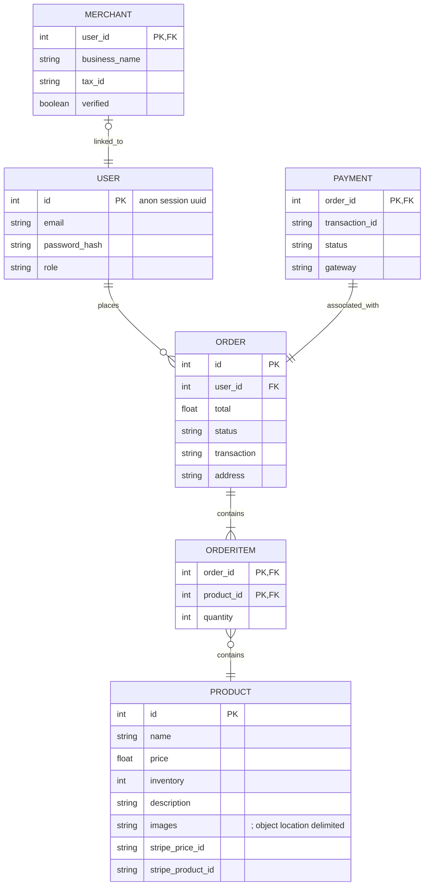

# Ecommerce-app
An Ecommerce Application.

# Quick Start
To start, simply clone this project along with its submodules with:
```bash
git clone --recurse-submodules git@github.com:CS464-ECOMMERCE/ecommerce-app.git

git submodule foreach "git checkout main && git pull"
## do this to git pull for each submodule 
```


## 🛠️ How to Run the Project Locally

### Option 1: Run with Docker Compose

#### ✅ Requirements
- Install [Docker](https://www.docker.com/).
- (Optional) Get your own [Stripe API keys](https://dashboard.stripe.com/apikeys) to create new products.

#### 🔑 Add Stripe Keys
Create a file named `testing.env` in the project root and add:
```env
STRIPE_SECRET_KEY=''
NEXT_PUBLIC_STRIPE_KEY=''
```
> ⚠️ You can skip this if you just want to test without checkout and adding new products — some products are already added using:
> - **Email:** `test@test.com`
> - **Password:** `testing`

#### ▶️ Start the Project
```bash
make run
```

#### ⏹️ Stop the Project
Press `Ctrl + C`, then run:
```bash
make stop
```

---

### Option 2: Run with Kubernetes (K8s)

#### ✅ Requirements
- For M1/M2 MacBooks:
  - Install [OrbStack](https://orbstack.dev/) with:
    ```bash
    brew install --cask orbstack
    ```
  - Or install [Minikube](https://minikube.sigs.k8s.io/docs/)
- Install [Tilt](https://docs.tilt.dev/)

#### ▶️ Start the Project
```bash
tilt up
```

#### ⏹️ Stop the Project
```bash
tilt down
```

---


# Architecture Diagram


# Architecture Overview

## Frontend

- The frontend is built using **Next.js** and hosted on **Vercel**.
- It communicates with the backend through a **GCP Load Balancer**, which routes API requests to **Traefik**.  
- Traefik acts as a reverse proxy that forwards the requests to the appropriate backend services.

---

## Backend

### Stateless Components

The backend's stateless services run on **Kubernetes** with a **Horizontal Pod Autoscaler** configured to scale based on **CPU and memory utilization**. These services include:

1. **API Server**
   - Exposes REST API endpoints for client interactions.
   - Translates REST calls to gRPC requests to communicate with internal services.
   - Handles **authentication** for merchant users.

2. **Cart Service**
   - Exposes a gRPC server.
   - Manages customer carts, storing session-based cart data in **Redis**.

3. **Product Service**
   - Exposes a gRPC server.
   - Manages product information and inventory.
   - Handles order creation by communicating with the Cart Service to retrieve cart contents.

4. **Order Service**
   - Exposes a gRPC server.
   - Handles **Stripe payment logic** and order finalization.

---

### Stateful Components

Stateful backend services are deployed using **Kubernetes StatefulSets** to ensure stable network identities and persistent storage. These services use **Persistent Volumes** to retain data across pod restarts.

1. **PostgreSQL**
   - Stores structured data across several tables: `user`, `merchant`, `product`, `order`, `order_item`, and `payment`.

2. **Redis**
   - Stores session-based cart data using the session ID as a hash key.
   - Ensures low-latency access for cart operations.


# ER Diagram
