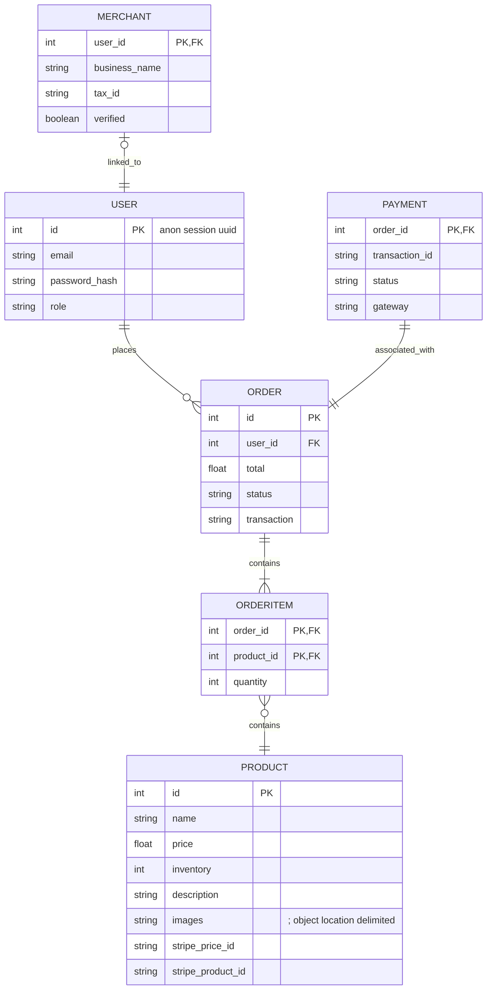

# Ecommerce-app
An Ecommerce Application.

# Quick Start
To start, simply clone this project along with its submodules with:
```bash
git clone --recurse-submodules git@github.com:CS464-ECOMMERCE/ecommerce-app.git

git submodule foreach "git checkout main && git pull"
## do this to git pull for each submodule 
```

# ER Diagram
